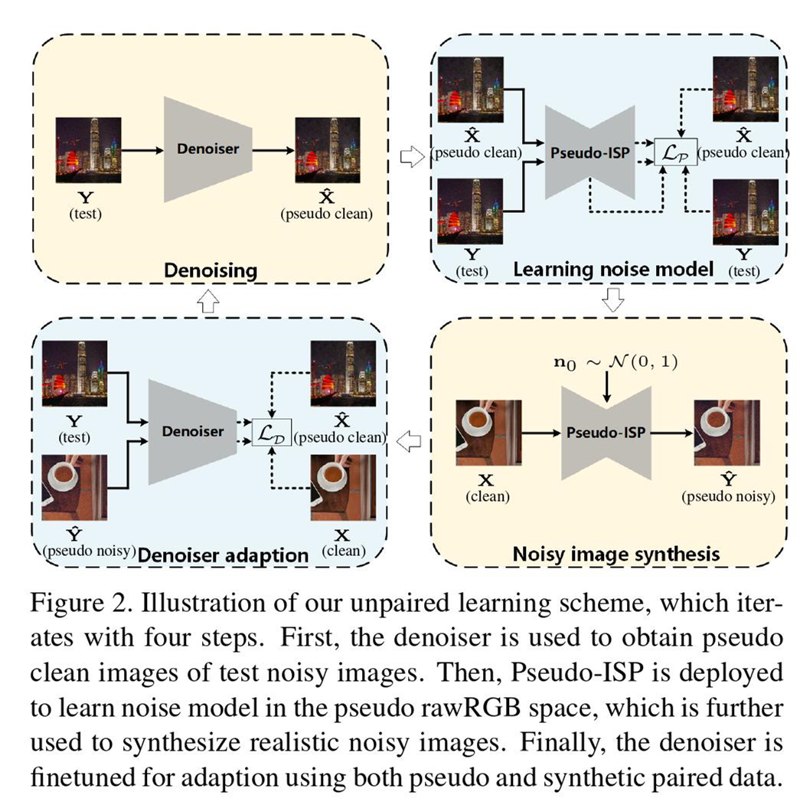
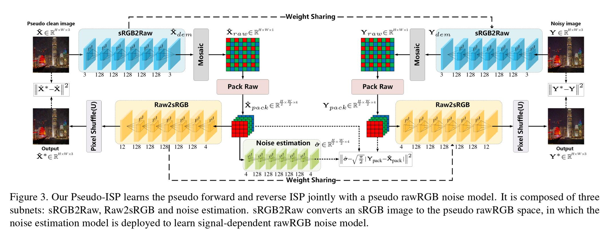
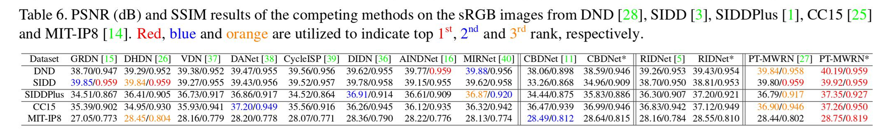

# Pseudo-ISP: Learning Pseudo In-camera Signal Processing Pipeline from A Color Image Denoiser

## Abstract

The success of deep denoisers on real-world color photographs usually relies on the modeling of sensor noise and in-camera signal processing (ISP) pipeline. Performance drop will inevitably happen when the sensor and ISP pipeline of test images are different from those for training the deep denoisers (i.e., noise discrepancy). In this paper, we present an unpaired learning scheme to adapt a color image denoiser for handling test images with noise discrepancy. We consider a practical training setting, i.e., a pretrained denoiser, a set of test noisy images, and an unpaired set of clean images. To begin with, the pre-trained denoiser is used to generate the pseudo clean images for the test images. Pseudo-ISP is then suggested to jointly learn the pseudo ISP pipeline and signal-dependent rawRGB noise model using the pairs of test and pseudo clean images. We further apply the learned pseudo ISP and rawRGB noise model to clean color images to synthesize realistic noisy images for denoiser adaption. Pseudo-ISP is effective in synthesizing realistic noisy sRGB images, and improved denoising performance can be achieved by alternating between Pseudo-ISP training and denoiser adaption. Experiments show that our Pseudo-ISP not only can boost simple Gaussian blurring-based denoiser to achieve competitive performance against CBDNet, but also is effective in improving state-of-the-art deep denoisers, e.g., CBDNet and RIDNet.

## Illustration of our unpaired learning scheme

Illustration of our unpaired learning scheme, which iterates with four steps. First, the denoiser is used to obtain pseudo clean images of test noisy images. Then, Pseudo-ISP is deployed to learn noise model in the pseudo rawRGB space, which is further used to synthesize realistic noisy images. Finally, the denoiser is finetuned for adaption using both pseudo and synthetic paired data. 

## Learning PseudoISP for Noise Modeling

We constitute our Pseudo-ISP involving three subnets, i.e.,sRGB2Raw, Raw2sRGB and noise estimation (see Fig. 3).

## Comparison with State-of-the-arts

Table 6 lists the PSNR and SSIM results. On all datasets, CBDNet*, RIDNet* and PT-MWRN* outperform their counterparts, indicating that our Pseudo-ISP can be incorporated with different pre-trained denoisers for handling various kinds of noise discrepancy.

## Dataset Download Link

Download the mat file of DND dataset

- [BaiduNetDisk](https://pan.baidu.com/s/1W8_Uemrm8coX3wFZ_Jlw1g ) password：6aj4

## Pre-trained Denoising Model Download Link

- [BaiduNetDisk](https://pan.baidu.com/s/1W8_Uemrm8coX3wFZ_Jlw1g ) password：6aj4

## Contact

Please send email to cscaoyue@gmail.com or cscaoyue@hit.edu.cn
